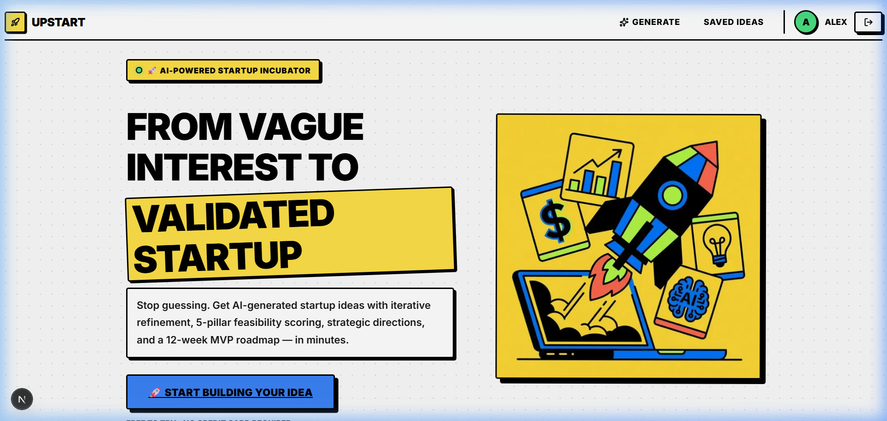
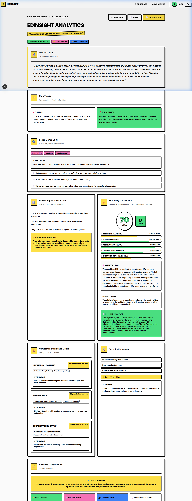

<div align="center">
  <h1>🚀 Upstart - AI Idea Evolution Engine</h1>
  <p>
    <strong>Turn vague interests into validated startup or project ideas with full execution roadmaps.</strong>
  </p>
  <p>
    <a href="#-the-problem">The Problem</a> •
    <a href="#-our-solution">Our Solution</a> •
    <a href="#-key-features">Key Features</a> •
    <a href="#-getting-started">Getting Started</a>
  </p>
</div>

---

## 🎯 The Problem

Many students and early builders struggle with:
- Not knowing what project or startup to build.
- Choosing ideas without market validation.
- Lacking technical or market research knowledge.
- Having no clear execution roadmap.

This often results in wasted time building low-impact, unrealistic, or unoriginal projects.

## 💡 Our Solution

Upstart, your AI-powered digital incubator, solves this by providing a system that:
- Converts broad interests into specific problem statements.
- Evaluates market opportunity and analyzes competitors.
- Calculates technical and overall feasibility.
- Suggests optimized tech stacks and monetization models.
- Generates a comprehensive, step-by-step MVP development roadmap.

---

## 🌟 Key Features

* **🤖 AI Idea Generator**: Input a domain/interest and get multiple actionable problem-solution ideas powered by LLMs.
* **📊 Market Opportunity Analyzer**: Get insights on demand and competition levels to validate your idea instantly.
* **⚖️ Feasibility Engine**: Evaluates technical difficulty, estimated time, and skill match to provide a realistic feasibility score.
* **🗺️ Venture Blueprint & MVP Roadmap**: Offers tailored tech stack suggestions, monetization models (SaaS, Freemium, API), and a detailed week-by-week development plan.
* **💾 Export & Save**: Save your idea blueprints to your account dashboard or export them as PDFs for pitch decks and future reference.

---

## 📸 Screenshots

### Enhanced Landing Page


### Venture Blueprint Dashboard


---

## 👥 Target Audience

* **Primary Users**: College students selecting final year projects, Hackathon participants, Beginner entrepreneurs.
* **Secondary Users**: Indie developers, Startup enthusiasts, Incubation programs looking for structured ideation.

---

## 🛠 Tech Stack & Architecture

### Frontend (Client Layer)
* **Framework**: Next.js 16 / React 19
* **Styling**: Tailwind CSS 4
* **UI & Icons**: Lucide React Icons
* **Hosting**: Vercel (Configured for deployment)

### Backend (API Layer)
* **Runtime**: Node.js
* **Framework**: Express.js
* **Database**: SQLite (`better-sqlite3`) for user data and saved blueprints
* **Authentication**: JWT & `bcryptjs` for secure user sessions
* **AI Engine**: Google Generative AI / Groq API for core content generation

---

## 🚀 Getting Started

To get a local copy up and running, follow these simple complete steps.

### Prerequisites

* Node.js (v18 or higher)
* npm or yarn package manager

### 1. Clone the repository

```bash
git clone https://github.com/MDMOINAKHTARR/UpWork.git
cd UpWork
```

### 2. Setup the Backend

```bash
cd backend
npm install
```

Create a `.env` file in the `backend` directory with the following variables:
```env
GROQ_API_KEY=your_groq_api_key
JWT_SECRET=your_secret_key
PORT=5000
FRONTEND_URL=http://localhost:3000
```

Start the backend development server:
```bash
npm run dev
```

### 3. Setup the Frontend

Open a new terminal window/tab:
```bash
cd frontend
npm install
```

Start the frontend development server:
```bash
npm run dev
```

### 4. Let's Build!
Open your browser and navigate to `http://localhost:3000` to start evolving your boldest ideas!

---

## 🧠 Data Flow Architecture

1. **User Input** → Submits interests/domain via Next.js UI.
2. **Backend API** → Express handles validation, routing, and prompt construction.
3. **AI Processing** → Groq / Google Gen AI creates structured, JSON-formatted blueprints.
4. **Storage** → Results are safely stored in the local SQLite Database.
5. **Dashboard** → Users view and interact with their saved Venture Blueprints.

---

## 🔮 Future Enhancements (Roadmap)

- [ ] Real-time market data integration (Google Trends, Crunchbase)
- [ ] Pitch deck auto-generation algorithms
- [ ] Investor readiness score
- [ ] Idea → Prototype visual code generator
- [ ] Co-founder & Team matching feature

---

## 📄 License

This project is licensed under the **ISC License**.